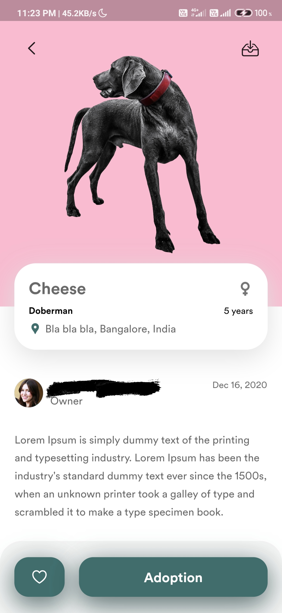
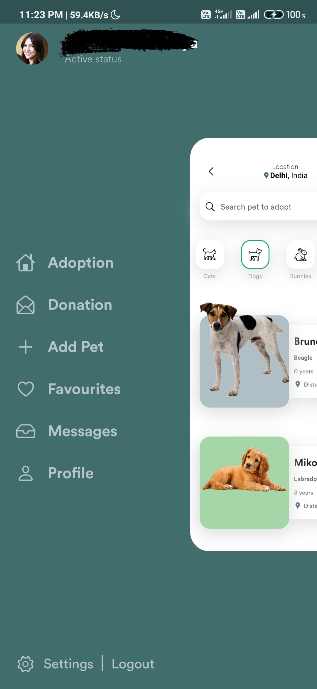
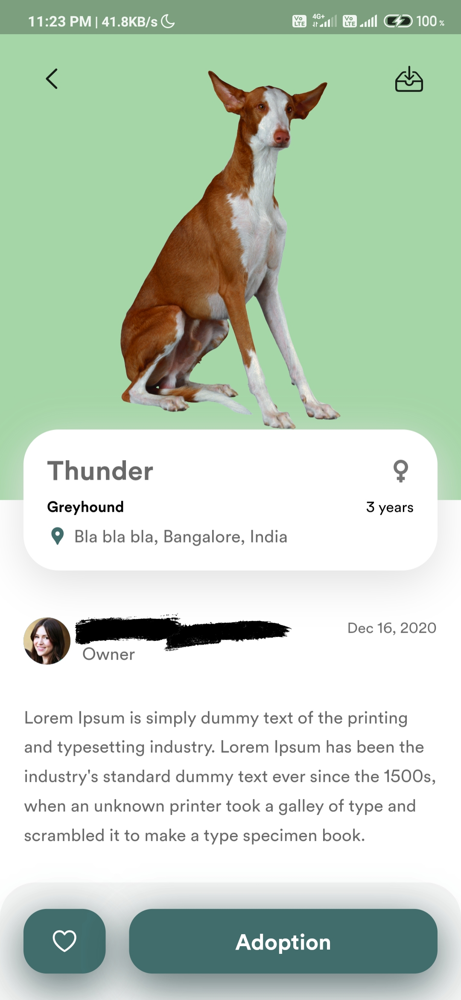

# PetApp

An (Sample)app that allows users to donate their pets and adopt others pets.

## About

I created this app to learn more about Flutter and UI/UX in general. This app's design was taken from Dribbble and I followed a tutorial by The Growing Developer on YouTube to complete this app. The app currently has two full screens and a side-drawer. The most fascinating thing about the app is it's unique side-drawer that makes the active page shrink and appears from the back.

## Preview

Screenshots from the app:

</img>
</img>
</img>
</img>
